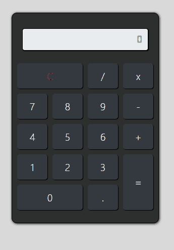

# Calculadora (Em atualização)

<h3>Linguagens utilizadas nesse projeto </h3>
  
 

          
 
 
 

Projeto desenvolvido para fins de estudo  de uma calculadora.
Neste projeto foi incluso efeito sonoro com ativação e desativação do bip, através do duplo click no botão C.

  

</img>
   
  
https://michaelsilvarj.github.io/Calculadora/

